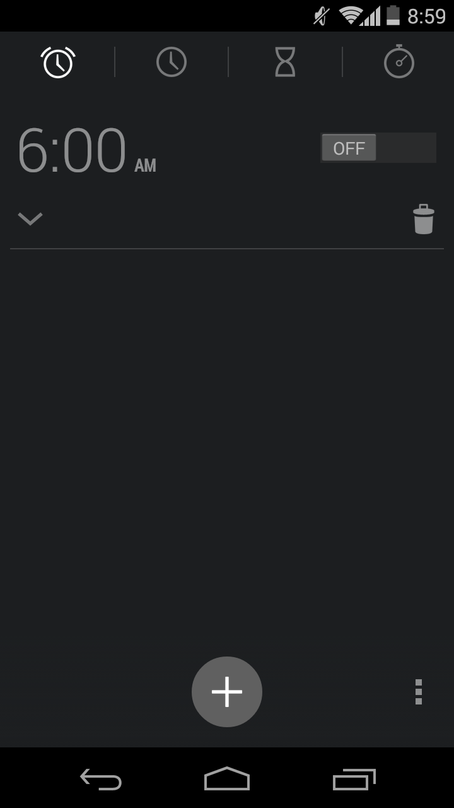
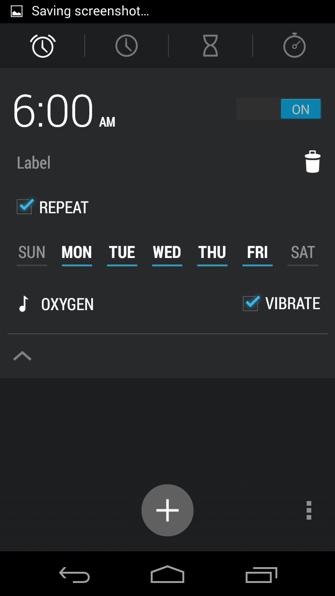
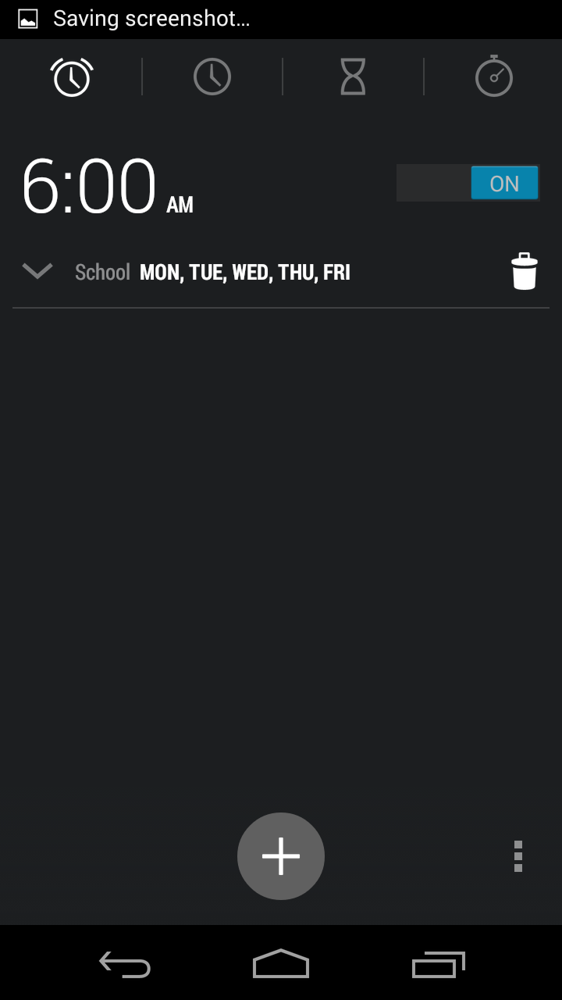

# Alarm
The alarm component holds all control and information about an alarm clock. It can be instantiated from the Alarm class found in alarm.js file. The following screenshots (from Android v4.4.4 alarm clock) show the expected graphical results with the alarm element being in the
spotlight (please, disconsider the background elements):

<div id="images-container" style="display: flex; flex-direction: row; align-items: center; justify-content: space-between">
    
    
    
</div>

## Methods
There are some methods that can be called directly (public access). They are:
* **getSetting** - get the current the alarm time, ringtone, repeat and vibrate settings
* **setSetting** - set the current the alarm time, ringtone, repeat and vibrate settings
* **show** - display the alarm element and place it above the others (z-index: 1000)
* **hide** - hide the alarm element (display: none)
* **displayMobile** - display the layout for mobile devices
* **displayDesktop** - display the layout for desktop devices
* **getNodeElement** - get the DOM node with class .alarm
* **addAlarmChangeListener** - register a callback function to the alarm-change event
* **removeAlarmChangeListener** - unregister the given callback function from alarm-change event

Every other method starting with an underscore is private. Thus, is shouldn't be called outside the class, otherwise, it may crush the component.

## Events
The alarm element handles only one type of event, which is called alarm-change. This event is fired every time a setting is changed, for example, if the user changes the alarm ringtone, then every callback function that is registered for the alarm-change event will be called.

Every event gives back an object containing the following properties:<br>
<pre>
setting:    current setting
target:     Alarm object
eventName:  alarm-change
</pre>

The code below shows a use case of event handling. It creates the alarm object, append the DOM element to the body of the document and displays it. Then, every event is handled by the function printEventNameAndLabel. Once the event is fired, the handler logs its event and label name in the console.
```javascript
// *********************** Boilerplate code ***********************

const alarm = new Alarm(document);

document.body.appendChild(alarm.getNodeElement());

alarm.show();


// *********************** Actual event handling ***********************

function printEventNameAndLabel(event) {
    console.log(event.eventName, event.label);
}

alarm.addAlarmChangeListener(printEventNameAndLabel);
```

## Folder organization
<pre>
\-- <b>alarm</b>                 - Folder containing the whole alarm module.
    \-- <b>build</b>             - Folder containing the generated code to run this component standalone.
    \-- <b>dev</b>               - Folder containing the source code to run this component standalone.
    \-- <b>screenshot</b>        - Folder containing the screenshots used as a reference to build the GUI.
    \-- <b>test</b>              - Folder containing the test file used to validate the Alarm class.
    |-- alarm.pug         - PUG file that is used to generate the components HTML model.
    |-- alarm.js          - JavaScript class with methods and events.
    |-- alarm.sass        - Style file in Sass format.
    |-- README.md         - This README file.
</pre>