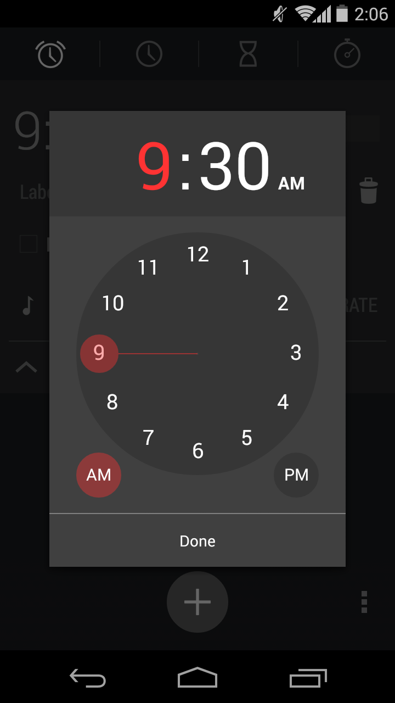

# time-setting
The time-setting component displays a hour/minute wheel with a pointer that can be dragged into the desired value. This time-setting design was copied from Android v4.4.4 alarm clock. The time-setting component can be created from a instance of the TimeSetting class. The following screenshots show the components (in the spotlight) expected graphic results (please, disconsider the background elements):

    
    
    

## Methods
There are fourteen methods in total that can be call outside the TimeSetting class (public methods). They are:
* **getTime** - get the current time in the { hour, minute } format
* **setTime** - set the current ringtone by a object with the { hour, minut } properties
* **show** - display the time-setting element and place it above the others (z-index: 1000)
* **hide** - hide the time-setting element
* **getNodeElement** - get the DOM node with class .time-setting
* **addTimeCancelListener** - register a callback function to the time-cancel event
* **addTimeChangeListener** - register a callback function to the time-change event
* **addTimeDoneListener** - register a callback function to the time-done event
* **removeTimeCancelListener** - unregister the given callback function from time-cancel event
* **removeTimeChangelListener** - unregister the given callback function from time-change event
* **removeTimeDoneListener** - unregister the given callback function from time-done event

Every other method starting with an underscore is private. Thus, is shouldn't be called
outside the class, otherwise, it may crush the component.