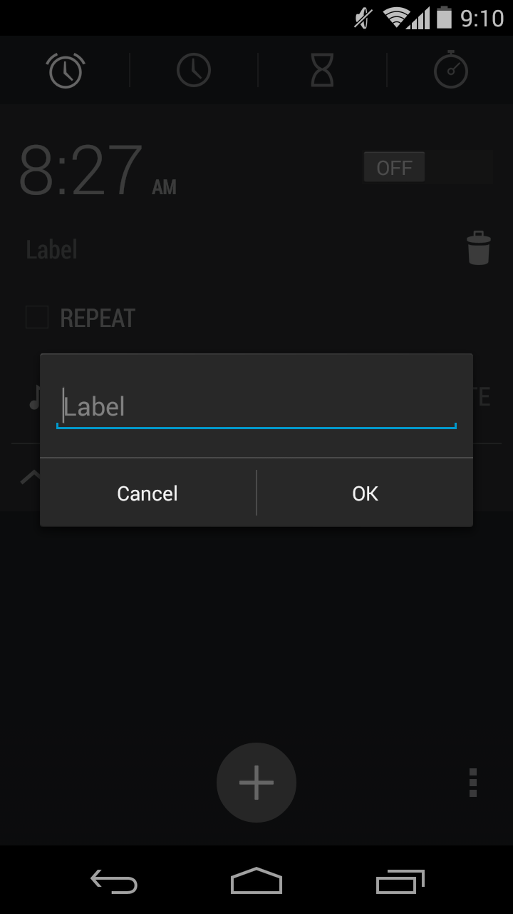
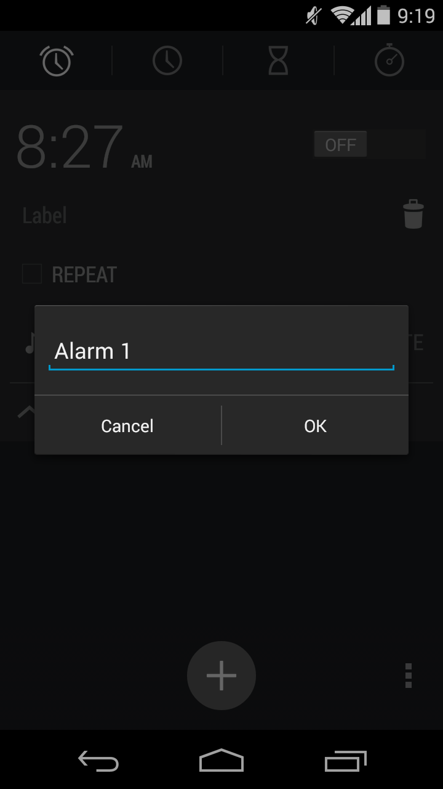
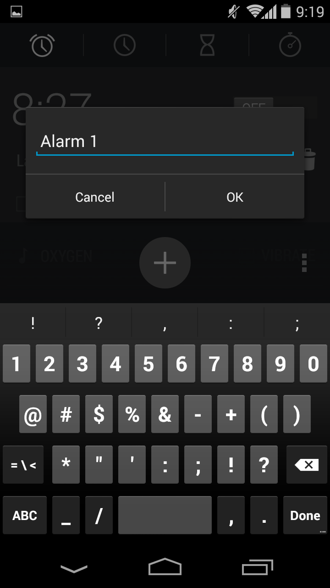

# label-input
The label-input component is used to receive an user text input and
send it to anyone who is interested. The following screenshots (from Android v4.4.4 alarm clock) show the expected graphical results:

<div id="images-container" style="display: flex; flex-direction: row; align-items: center; justify-content: space-between">
    
    
    
</div>

## Events

### label-change
The label-change event happens when the user enters a new label that is different
from the previews one. This event is fired only if the label is changed and the user
hit Enter or click OK. Code example:
```javascript
const labelInput = new LabelInput(document);

function printEventName(event) {
    console.log(event.event);
}

labelInput.addLabelChangeEventListener(printEventName);
```
