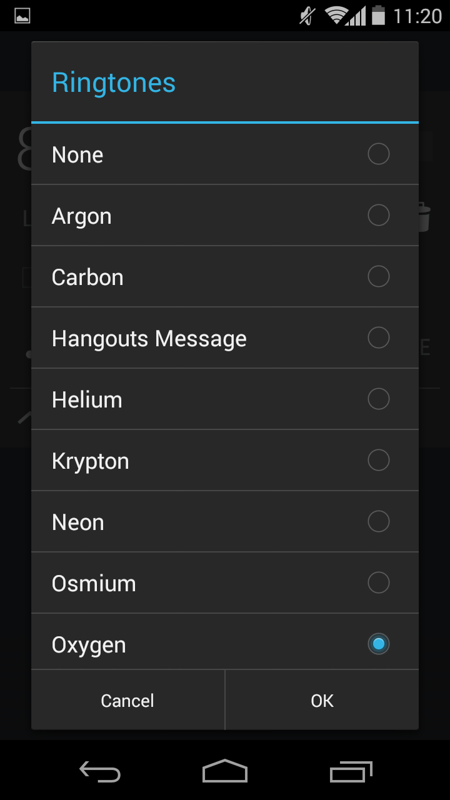

# ringtone-list
The ringtone-list component displays a list a ringtones that the user can select and preview. These songs are extracted from the list a ringtones available on Android v4.4.4 alarm clock. This component is instantiated from the RingtoneList class found in the ringtone-list.js file. The following screenshot shows the components (in the spotlight) expected graphic results (please, disconsider the background elements):
<div style="display: flex; align-items: center; justify-content: center">
    
</div>

## Methods
There are thirteen methods in total that can be call outside the RingtoneList class (public methods). They are:
* **getRingtone** - get the current ringtone name
* **setRingtone** - set the current ringtone name
* **enableSound** - enable sound to play when the user select a ringtone
* **disableSound** - disable sound to play when the user select a ringtone
* **show** - display the ringtone-list element and place it above the others (z-index: 1000)
* **hide** - hide the ringtone-list element
* **getNodeElement** - get the DOM node with class .ringtone-list
* **addRingtoneCancelListener** - register a callback function to the ringtone-cancel event
* **addRingtoneChangeListener** - register a callback function to the ringtone-change event
* **addRingtoneDoneListener** - register a callback function to the ringtone-done event
* **removeRingtoneCancelListener** - unregister the given callback function from ringtone-cancel event
* **removeRingtoneChangelListener** - unregister the given callback function from ringtone-change event
* **removeRingtoneDoneListener** - unregister the given callback function from ringtone-done event

Every other method starting with an underscore is private. Thus, is shouldn't be called
outside the class, otherwise, it may crash the component.

## Events
The ringtone-list element handles three types of events. They are ringtone-change, ringtone-done and ringtone-cancel.
Every event gives back an object containing the following properties:<br>
<pre>
ringtone:  current ringtone name
target:    ringtoneList object
eventName: event name (ringtone-cancel, ringtone-change or ringtone-done)
</pre>

The code below shows a use case of event handling. It creates the ringtone-list object, append the DOM element to the body of the document and displays it. Then, every kind of event is handled by the same function (printEventNameAndRingtone). Once the event is fired,
the handler logs its event and ringtone name in the console.
```javascript
// *********************** Boilerplate code ***********************

const ringtoneList = new RingtoneList(document);

document.body.appendChild(ringtoneList.getNodeElement());

ringtoneList.show();


// *********************** Actual event handling ***********************

function printEventNameAndRingtone(event) {
    console.log(event.eventName, event.ringtone);
}

ringtoneList.addRingtoneCancelListener(printEventNameAndRingtone); // ringtone-cancel
ringtoneList.addRingtoneChangeListener(printEventNameAndRingtone); // ringtone-change
ringtoneList.addRingtoneDoneListener(printEventNameAndRingtone);   // ringtone-done
```

### ringtone-cancel
The ringtone-cancel event is fired every time the user hits Esc, click outside the
ringtones class or click Cancel.

### ringtone-change
The ringtone-change event happens when the user select a ringtone that is different
from the previews one. This event is fired only if the ringtone is changed and the user
hits Enter or click OK.

### ringtone-done
The ringtone-change event is fired every time the user hits Enter or click OK.

## Folder organization
<pre>
\-- <b>ringtone-list</b>           - Folder containing the whole ringtone-list module.
    \-- <b>build</b>               - Folder containing the generated code to run this component standalone.
    \-- <b>dev</b>                 - Folder containing the source code to run this component standalone.
    \-- <b>screenshot</b>          - Folder containing the screenshots used as a reference to build the GUI.
    \-- <b>test</b>                - Folder containing the test file used to validate the ringtoneList JavaScript class.
    |-- ringtone-list.html  - HTML code that is generated once the component is instantiated.
    |-- ringtone-list.js    - JavaScript class with methods and events.
    |-- ringtone-list.sass  - Style file in Sass format.
    |-- README.md           - This README file.
</pre>