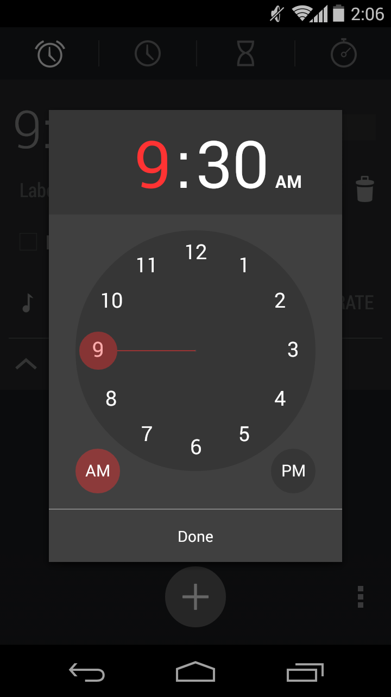
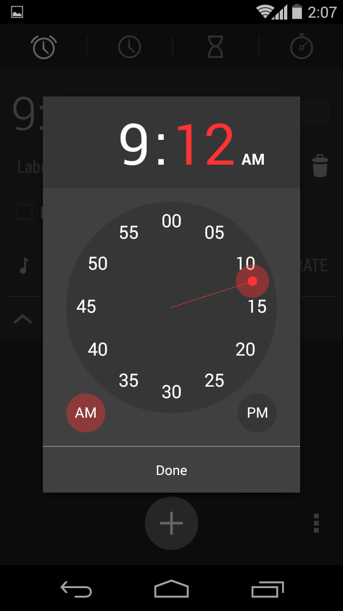

# time-setting
The time-setting component displays a hour/minute wheel with a pointer that can be dragged into the desired value. This time-setting design was copied from Android v4.4.4 alarm clock. The time-setting component can be created from a instance of the TimeSetting class. The following screenshots show the components (in the spotlight) expected graphic results (please, disconsider the background elements):
<div class="img-container" style="display: flex; flex-direction: row; align-items: center; justify-content: space-between">
    
    
    
</div>

## Methods
There are fourteen methods in total that can be call outside the TimeSetting class (public methods). They are:
* **getTime** - get the current time in the { hour, minute, meridiem } format
* **setTime** - set the current ringtone by a object with the { hour, minute, meridiem } properties
* **show** - display the time-setting element and place it above the others (z-index: 1000)
* **hide** - hide the time-setting element
* **getNodeElement** - get the DOM node with class .time-setting
* **addTimeCancelListener** - register a callback function to the time-cancel event
* **addTimeChangeListener** - register a callback function to the time-change event
* **addTimeDoneListener** - register a callback function to the time-done event
* **removeTimeCancelListener** - unregister the given callback function from time-cancel event
* **removeTimeChangelListener** - unregister the given callback function from time-change event
* **removeTimeDoneListener** - unregister the given callback function from time-done event

Every other method starting with an underscore is private. Thus, is shouldn't be called
outside the class, otherwise, it may crush the component.

## Events
The time-list element handles three types of events. They are time-change, time-done and time-cancel.
Every event gives back an object containing the following properties:<br>
<pre>
time:      current time in the { hour, minute, meridiem } format
target:    TimeSetting object
eventName: event name (time-cancel, time-change or time-done)
</pre>

The code below shows a use case of event handling. It creates the time-setting object, append the DOM element to the body of the document and displays it. Then, every kind of event is handled by the same function (printEventNameAndTime). Once the event is fired,
the handler logs its event and time in the console.
```javascript
// *********************** Boilerplate code ***********************

const timeSetting = new TimeSetting(document);

document.body.appendChild(timeSetting.getNodeElement());

timeSetting.show();


// *********************** Actual event handling ***********************

function printEventNameAndTime(event) {
    console.log(event.eventName, event.time);
}

timeSetting.addTimeCancelListener(printEventNameAndTime); // time-cancel
timeSetting.addTimeChangeListener(printEventNameAndTime); // time-change
timeSetting.addTimeDoneListener(printEventNameAndTime);   // time-done
```

### time-cancel
The time-cancel event is fired every time the user hits Esc, click outside the
time-container class or click Cancel.

### time-change
The time-change event happens when the user select a time setting that is different
from the previews one. This event is fired only if the time setting is changed and the user
hits Enter or click OK.

### time-done
The time-done event is fired every time the user hits Enter or click OK.

## Folder organization
<pre>
\-- <b>time-setting</b>            - Folder containing the whole time-setting module.
    \-- <b>build</b>               - Folder containing the generated code to run this component standalone.
    \-- <b>dev</b>                 - Folder containing the source code to run this component standalone.
    \-- <b>screenshot</b>          - Folder containing the screenshots used as a reference to build the GUI.
    \-- <b>test</b>                - Folder containing the test file used to validate the ringtoneList JavaScript class.
    |-- time-setting.html   - HTML code that is generated once the component is instantiated.
    |-- time-setting.js     - JavaScript class with methods and events.
    |-- time-setting.sass   - Style file in Sass format.
    |-- README.md           - This README file.
</pre>